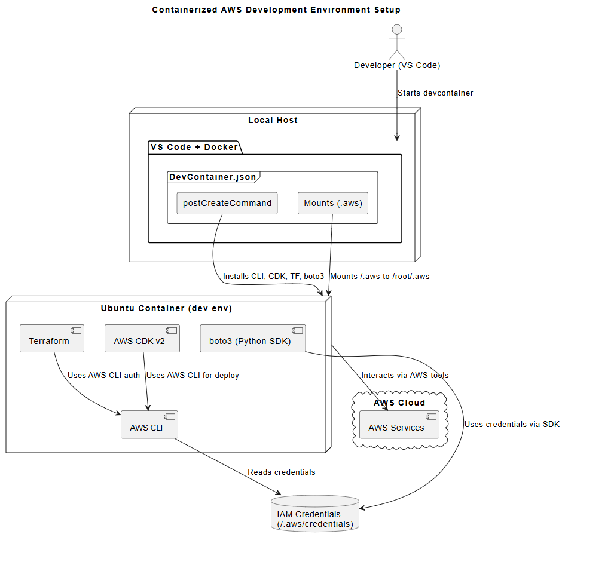

# AWS SAA-C03 Development Environment

> Containerized AWS development environment for Solutions Architect Associate certification study and practice.

[](https://aws.amazon.com/certification/certified-solutions-architect-associate/)
[](https://www.docker.com/)
[](https://code.visualstudio.com/)

## Overview

A fully containerized development environment with pre-configured AWS tools for hands-on learning and practice. Zero setup time - everything works out of the box across Windows, macOS, and Linux.

## Pre-installed Tools

| Tool          | Version   | Purpose                       |
| ------------- | --------- | ----------------------------- |
| **AWS CLI**   | v2 Latest | AWS service management        |
| **Terraform** | Latest    | Infrastructure as Code        |
| **AWS CDK**   | v2 Latest | Cloud application development |
| **Python 3**  | 3.10+     | Automation with boto3         |
| **Node.js**   | 20 LTS    | CDK runtime                   |
| **boto3**     | Latest    | AWS SDK for Python            |



## 🚀 Quick Setup

### Prerequisites

- [Docker Desktop](https://www.docker.com/products/docker-desktop) (Windows/macOS) or Docker Engine (Linux)
- [Visual Studio Code](https://code.visualstudio.com/)
- [Dev Containers Extension](https://marketplace.visualstudio.com/items?itemName=ms-vscode-remote.remote-containers)
- AWS Account ([Free Tier](https://aws.amazon.com/free/) recommended)

### Installation

1. **Clone and open the project**

   ```bash
   git clone https://github.com/Project-Be-Better/learning-aws-SAA-C03.git
   cd learning-aws-SAA-C03
   code .
   ```

2. **Launch dev container**

   - Click "Reopen in Container" when prompted
   - Or: `Ctrl+Shift+P` → "Dev Containers: Reopen in Container"

3. **Configure AWS credentials** (choose one option)

   **Option A: AWS CLI (Recommended)**

   ```bash
   aws configure
   # Enter: Access Key ID, Secret Key, Region (us-east-1), Output format (json)
   ```

   **Option B: Environment variables**

   ```bash
   cp .env.example .env
   # Edit .env with your AWS credentials
   ```

   **Option C: Use existing credentials**

   - Container automatically mounts `~/.aws` from host system

4. **Verify setup**
   ```bash
   aws sts get-caller-identity  # Verify AWS access
   terraform version            # Check Terraform
   cdk --version               # Check AWS CDK
   python3 -c "import boto3; print('✅ Ready')"
   ```

## 📁 Project Structure

```
learning-aws-SAA-C03/
├── .devcontainer/          # Container configuration
│   ├── Dockerfile         # Ubuntu 22.04 + AWS tools
│   ├── devcontainer.json  # VS Code settings
│   └── bootstrap.sh       # Setup script
├── .aws/                  # AWS config templates
├── .env.example          # Environment template
└── .gitignore            # Protects credentials
```

## Usage Examples

### AWS CLI Commands

```bash
aws sts get-caller-identity     # Check AWS identity
aws ec2 describe-instances      # List EC2 instances
aws s3 ls                       # List S3 buckets
```

### Terraform Workflow

```bash
cd terraform/
terraform init
terraform plan
terraform apply
```

### AWS CDK Workflow

```bash
cdk init app --language=typescript
cdk deploy
```

### Python with boto3

```python
import boto3
ec2 = boto3.client('ec2')
response = ec2.describe_instances()
```

## 🚨 Troubleshooting

### Authentication Issues

```bash
# Check credentials
aws sts get-caller-identity

# Reconfigure if needed
aws configure
```

### Container Issues

- **Rebuild container**: `Ctrl+Shift+P` → "Dev Containers: Rebuild Container"
- **Check Docker**: Ensure Docker Desktop is running
- **Re-run setup**: `bash .devcontainer/bootstrap.sh`

## Security Notes

- ✅ AWS credentials are excluded from git via `.gitignore`
- ✅ Use AWS Free Tier resources to minimize costs
- ✅ Set up billing alerts for cost monitoring
- ✅ Clean up resources after practice sessions

## Reference

1. https://docs.aws.amazon.com/cli/v1/userguide/cli-configure-envvars.html
2. https://code.visualstudio.com/docs/devcontainers/create-dev-container#_set-up-a-folder-to-run-in-a-container
